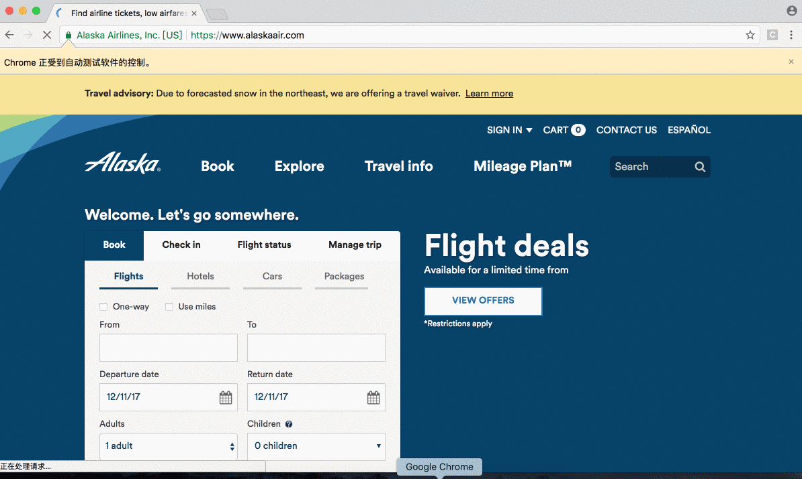
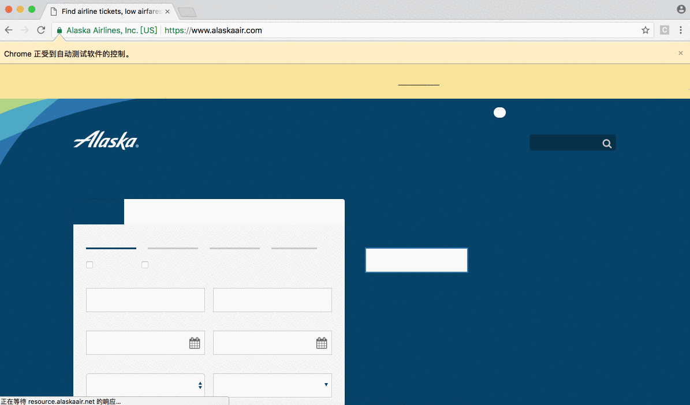

# Selenium Automated Testing on Alaska Airline official website - www.alaskaair.com

The **Selenium Testing** tests the sign-in process, verifies the account information, performs searching and booking flight tickets. It's developed using Selenium WebDriver, testing framework TestNG, Maven to manage dependencies, log4j to generate logs, Jenkins to build tests and publish test results.

*Demo*:
First testing tests the sign-in functionality and verifies the account information.


Second testing tests searching and booking 3 adult flight tickets on 01/18/2017
At the end, the terminal displays all two testings pass.



## Install

Clone the repository.
```bash
$ git clone https://github.com/xxin666/selenium_airlinetest.git
```

## Run
Use Maven to build and run the tests
```bash
$ cd selenium_airlinetest
$ mvn test
```
